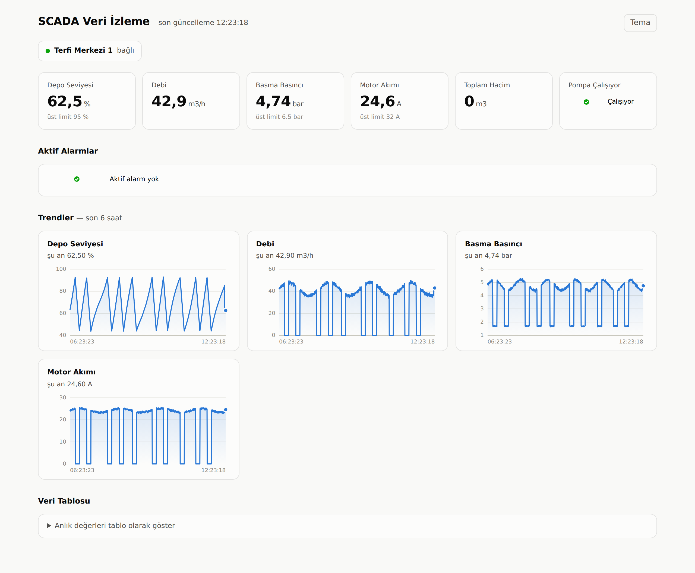
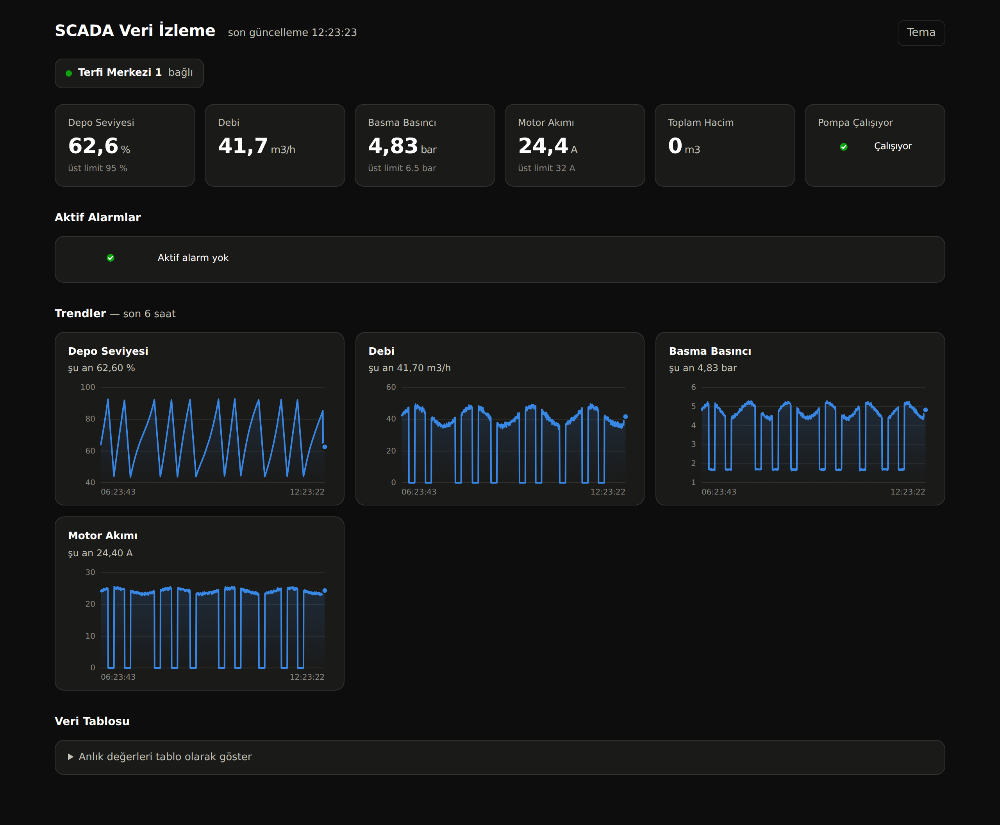

# Modbus SCADA Data Logger

A small, production-shaped data acquisition stack for industrial equipment:
poll Modbus TCP devices on a fixed interval, store the samples in SQLite,
evaluate alarm limits, and serve a read-only web dashboard.

Built to solve a common problem on small plants and utility sites: the PLC
knows everything, and nobody outside the control room can see any of it. A
full SCADA license is expensive and overkill when all you need is trending,
alarming, and a daily report.



## Run it in 30 seconds

No PLC required — a simulated water booster station is included.

```bash
pip install -r requirements.txt
python run.py demo
# open http://127.0.0.1:8000
```

`demo` starts three processes: the Modbus simulator, the collector, and the
dashboard. To backfill some history so the trends have something to draw:

```bash
python tools/seed_demo_data.py --hours 6
```

## Architecture

```
  PLC / RTU  ──Modbus TCP──▶  collector  ──▶  SQLite  ──▶  Flask dashboard
  (or the included simulator)                             (read-only)
```

Three processes, deliberately decoupled:

| Component | File | Responsibility |
|---|---|---|
| Simulator | `simulator/plc_simulator.py` | Modbus TCP server running a small water-station process model. Development and demo only. |
| Collector | `collector/collector.py` | Polls every configured tag, scales raw registers, evaluates alarm limits, writes to SQLite. |
| Storage | `collector/db.py` | Schema, inserts, queries, retention purge. WAL mode so the dashboard can read while the collector writes. |
| Dashboard | `web/app.py` | JSON API + single-page dashboard. Never opens a Modbus connection. |

**The dashboard cannot write to the process.** It only reads SQLite. That is a
design decision, not an omission — it means the page can be handed to office
staff without any risk to the plant.

## Configuration

Adding a station or a tag is a `config.yaml` change, not a code change:

```yaml
devices:
  - name: pump_station_1
    host: 192.168.1.50
    port: 502
    device_id: 1
    tags:
      - name: discharge_pressure
        label: "Basma Basıncı"
        unit: "bar"
        type: holding      # or: discrete
        address: 1
        scale: 0.01        # raw register x100
        max_warn: 6.5      # opens an alarm above this

      - name: total_volume
        type: holding
        address: 6
        width: 32          # two consecutive registers, low word first
```

Supported per tag: `holding` / `discrete` reads, 16- and 32-bit values, signed
handling, engineering-unit scaling, and `min_warn` / `max_warn` / `alarm_on_true`
limits.

## What it handles

- **Device dropouts.** A failed poll closes the connection and backs off before
  retrying, so a dead device does not stall the other devices or spin the CPU.
- **Online vs. zero.** Device status is stored separately from the samples, so
  the dashboard distinguishes "no data" from "the value really is 0".
- **Alarm state, not alarm spam.** An alarm opens once and stays open until the
  condition clears; it is not re-raised on every poll cycle.
- **Retention.** Samples past `retention_days` are purged on startup and daily.
- **Slow-cycle warning.** If a poll cycle exceeds the configured interval, the
  collector logs it instead of silently drifting.

## API

| Endpoint | Returns |
|---|---|
| `GET /api/snapshot` | Latest value of every tag, device online state, open alarms |
| `GET /api/history/<device>/<tag>?hours=6` | Time series for one tag |
| `GET /api/summary/<device>/<tag>?days=7` | Daily min / avg / max |

JSON throughout, so the data is straightforward to pull into Excel, Grafana, or
a reporting script.

## Register map (simulator)

| Addr | Tag | Scale | Unit |
|---|---|---|---|
| 0 | Suction pressure | ×0.01 | bar |
| 1 | Discharge pressure | ×0.01 | bar |
| 2 | Flow rate | ×0.1 | m³/h |
| 3 | Motor current | ×0.1 | A |
| 4 | Motor frequency | ×0.1 | Hz |
| 5 | Tank level | ×0.1 | % |
| 6–7 | Total volume (32-bit) | ×1 | m³ |

Discrete inputs: 0 pump running, 1 pump fault, 2 low level, 3 high level.

## Dark mode



## Notes and limits

- SQLite is the right call up to roughly a few hundred tags at a 1–2 s poll
  rate. Past that, the storage layer in `collector/db.py` is the single place
  to swap for TimescaleDB or InfluxDB.
- Modbus TCP only for now. Modbus RTU over serial is a client swap in
  `DeviceReader`; the rest of the pipeline is transport-agnostic.
- No authentication on the dashboard. Put it behind a reverse proxy or a VPN
  before exposing it beyond a trusted network.

## License

MIT — see `LICENSE`.
